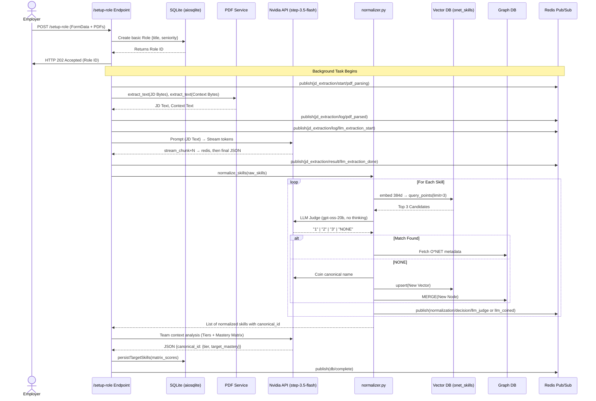
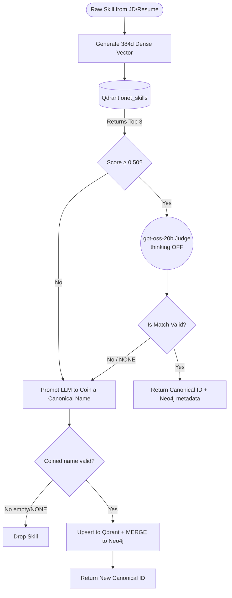
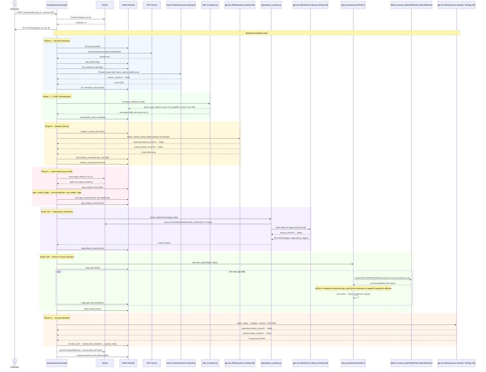

# AdaptIQ: System Working Flow

*Last updated: March 2026 — all 11 phases of the employee flow are live.*

This document explains how the AdaptIQ backend flows operate end-to-end, from the initial API request through all 11 pipeline phases down to database persistence.

---

## 🏗️ 1. The Employer Setup Flow (Orchestrator)

The core engine of the "Employer side" is the Orchestrator (`app/services/employer_flow/orchestrator.py`). It chains PDF parsing, LLM generation, vector search, and graph traversal in a single asynchronous background pipeline.

It heavily uses **Redis Pub/Sub** to stream its current step, LLM reasoning, and live token streams back to the frontend in real-time, preventing HTTP timeouts on long LLM calls.

### Sequence Diagram: Creating a Role



---

## 🧠 2. Advanced Skill Normalization (In-Depth)

`app/services/skill_normalizer.py` — grounds raw LLM skill names to O*NET canonical IDs.

**Why it matters:** "K8s" and "Kubernetes" both normalize to `TECH_kubernetes`. Without this, employee/employer skills can never match.

**The Agentic Pipeline:**
1. **Local vector search** (`intfloat/multilingual-e5-small`, 384-dim) — no external API call; fast.
2. **LLM Judge** (`gpt-oss-20b`, thinking OFF) — evaluates top-3 candidates semantically.  
   `complete()` returns **only** `content` (never reasoning) to prevent CoT text from becoming a skill name.
3. **Auto-coin & persist** — if NONE: new canonical node created in Qdrant + Neo4j permanently.



---

## 🔄 3. Redis + WebSocket Event Architecture

All heavy compute (embedding, vector search, LLM generation, graph traversal) takes 10–60 seconds per flow.

**Pattern:**
1. Frontend opens WS: `ws://api/employer/ws/setup/{role_id}` or `ws://api/employee/ws/{role_id}`.
2. HTTP POST returns **202 Accepted** immediately.
3. Background task fires hundreds of JSON events to Redis `channel:{role_id}`.
4. WS router subscribes and proxies events to browser tick-by-tick.

**Event envelope:**
```json
{"role_id": "...", "phase": "...", "type": "start|log|stream_chunk|stream_end|decision|result|complete|progress", "step": "...", "message": "...", "model": "...", "data": {}}
```

See `docs/employee_redis.md` for the complete event catalogue (Phases 6–11).

---

## 👤 4. The Employee Onboarding Flow (Phases 6–11)

`POST /api/v1/employee/onboard-path` — multipart: `role_id` + `resume` PDF.

`app/services/employee_flow/orchestrator.py` runs a linear, sequential pipeline of 6 phases. Each fires its own Redis events and passes its output to the next stage. All phases complete before `employee_persist_done` fires.

### Complete Sequence Diagram



---

## 📊 5. NSGA-II Course Selection (Detailed)

NSGA-II (Non-dominated Sorting Genetic Algorithm II) is used to select the best 1-course representative from a pool of up to 30 Qdrant-retrieved candidates for each skill gap.

**4 Objectives (all minimised):**

| Objective | Field | Meaning |
|---|---|---|
| `f1` | `-relevance_score` | Qdrant similarity — higher is better |
| `f2` | `duration_weeks` | Time to complete — faster is better |
| `f3` | `-(quality × popularity)` | Course quality and social proof |
| `f4` | `\|difficulty − required_level\|` | Perfect difficulty match |

**Three path archetypes:**

| Track | Selection Rule |
|---|---|
| Sprint | Candidate with lowest `f2` (fastest) on Pareto front |
| Balanced | Candidate closest to geometric centre of Pareto front |
| Quality | Candidate with lowest `f3` (highest quality×popularity) |

**Qdrant `courses_listed` collection:** 2048-dim vectors using `nvidia/nv-embedqa-e5-v5` (NemoRetriever). Schema per point: `{title, provider, duration_weeks, difficulty_level, quality_score, popularity}`.

---

## 🌳 6. Journey Tree Structure (Phase 11 Output)

The journey narration phase outputs a tree JSON consumed by the frontend bubble-tree renderer:

```
root (role goal)
  └── main_branch (skill gap, e.g. "Apache Kafka")
        ├── course_options: {sprint, balanced, quality}
        └── twig (prerequisite skill, e.g. "Python")
              └── course_options: {sprint, balanced, quality}
```

Node types and visual rules:
| node type | size | border colour |
|---|---|---|
| `role_goal` | large | blue |
| `main_branch` — critical gap | medium | `#EF4444` (red) |
| `main_branch` — moderate gap | medium | `#F59E0B` (amber) |
| `main_branch` — minor gap | medium | `#3B82F6` (blue) |
| `twig` | small | grey |

---

## 🔬 7. Machine Learning Pipeline (`machine_learning/`)

| Notebook | Status | Purpose |
|---|---|---|
| `01_data_exploration.ipynb` | ✅ Done | Profile O*NET taxonomy; identify key fields. |
| `02_data_preparation.ipynb` | ✅ Done | Export `resume_evidence.jsonl` + `jd_requirements.jsonl` (~2 k pairs). |
| `03_synthetic_pair_generation.ipynb` | 🔜 Next | LLM-augment to ~20 k skill context pairs. |
| `04_model_training.ipynb` | 🔜 Pending | Fine-tune `intfloat/multilingual-e5-small` on synthetic pairs (Kaggle GPU). |

**Goal:** Replace the current general-purpose 384-dim embedding model in `embedding_client.py` with a domain-specific model that understands resume/JD language for more accurate O*NET matching.
