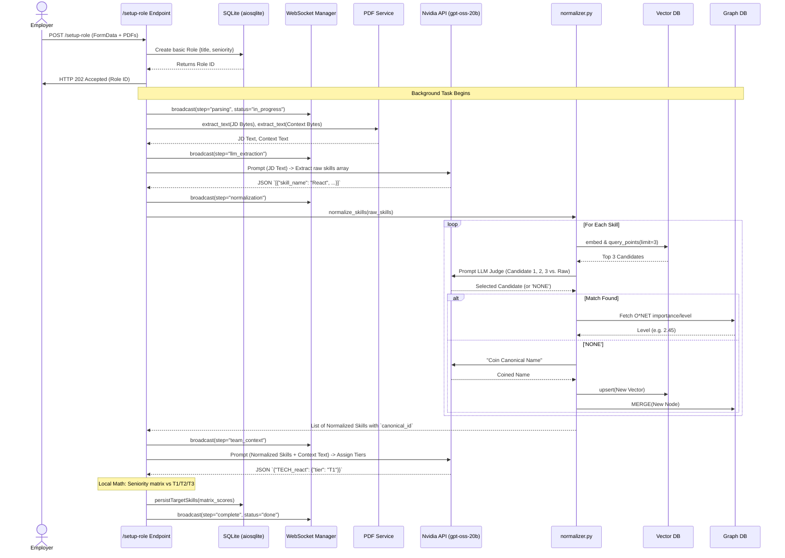
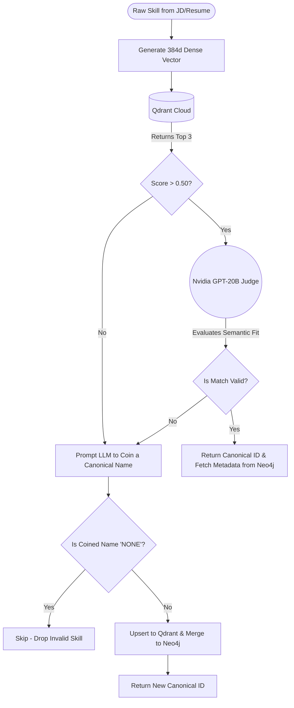

# AdaptIQ: System Working Flow

This document provides an in-depth explanation of how the AdaptIQ backend flows operate, from the initial API request down to database persistence.

---

## 🏗️ 1. The Employer Setup Flow (Orchestrator)

The core engine of the generic "Employer side" is the Orchestrator (`app/services/employer_flow/orchestrator.py`). It chains together PDF parsing, LLM generation, Vector search algorithms, and Graph traversals in a single asynchronous background pipeline. 

It heavily utilizes WebSockets via `app/api/routers/websocket.py` to stream its current step and status back to the frontend in real-time, preventing standard HTTP timeouts on long LLM calls.

### Sequence Diagram: Creating a Role

---

## 🧠 2. Advanced Skill Normalization (In-Depth)

The most complex sub-system is `app/services/skill_normalizer.py`. It is responsible for taking unstructured, messy LLM outputs from the JD parser and locking them strictly to the O*NET standard taxonomy. 

### Why is this needed?
If an employer asks for "K8s" and a candidate's resume says "Kubernetes", standard string matching yields a 0% match. By forcing both inputs through the normalizer, they both resolve to the standard Canonical ID `TECH_kubernetes`.

### The Agentic Pipeline
Unlike traditional fast-text matching, we use a 2-stage "Agentic" approach involving both our local Vector database and a live LLM "Judge". 

1. **Local Vector Search (`intfloat/multilingual-e5-small`)**: We generate an incredibly fast 384-dimension vector locally, without hitting an external API. We query Qdrant to find the 3 closest matches.
2. **Nvidia LLM Judge (`gpt-oss-20b`)**: The `openai/gpt-oss-20b` model streams chunks of reasoning directly from Nvidia's official architecture. It acts as an impartial judge, evaluating if Qdrant's candidates actually mean the same thing as the raw user input.
3. **Database Auto-Growth**: Traditional taxonomies rot over time as new tools are invented (e.g., "LangChain" doesn't exist in O*NET). If the LLM Judge determines no candidate matches, it generates a clean taxonomy name itself and **automatically provisions a new node in both Neo4j and Qdrant**. This ensures the system "learns" new technical terms permanently on the fly.

### Process Flow

## 🔄 3. Continuous WebSocket Integration

Because these flows involves heavy compute (Embedding, Vector Search, LLM Generation, Graph Traversal), a single `setup-role` operation can take 10 to 45 seconds.

Standard HTTP connections will timeout or leave the user staring at a blank loader. We solved this with `app/api/routers/websocket.py`.

* **Frontend**: Initiates a WebSocket connection: `ws://api/employer/ws/setup/{role_id}`.
* **Backend**: 
    1. Returns a 202 Accepted HTTP response to the original POST instantly.
    2. Modifies state locally.
    3. Triggers `manager.broadcast_to_session(role_id, payload)` asynchronously.
* **Result**: The frontend UI can dynamically check off boxes ("Parsing PDF..." -> "Extracting Skills..." -> "Normalizing against O*NET...") creating a modern, transparent "Execution Theatre" UX.
